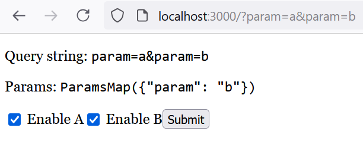

# Multi-value Parameter Example

1. Run <kbd>cargo leptos serve</kbd> (or <kbd>watch</kbd>).
2. Go to localhost:3000.
3. Check both boxes and click on Submit. This will correctly show both values in the query string in the address bar and the page, but the `ParamsMap` output will show only one. (The checkboxes always default to unchecked here.)
4. Either refresh the page or navigate to the same URL again. This will redirect the page so there is only one `param` value.

